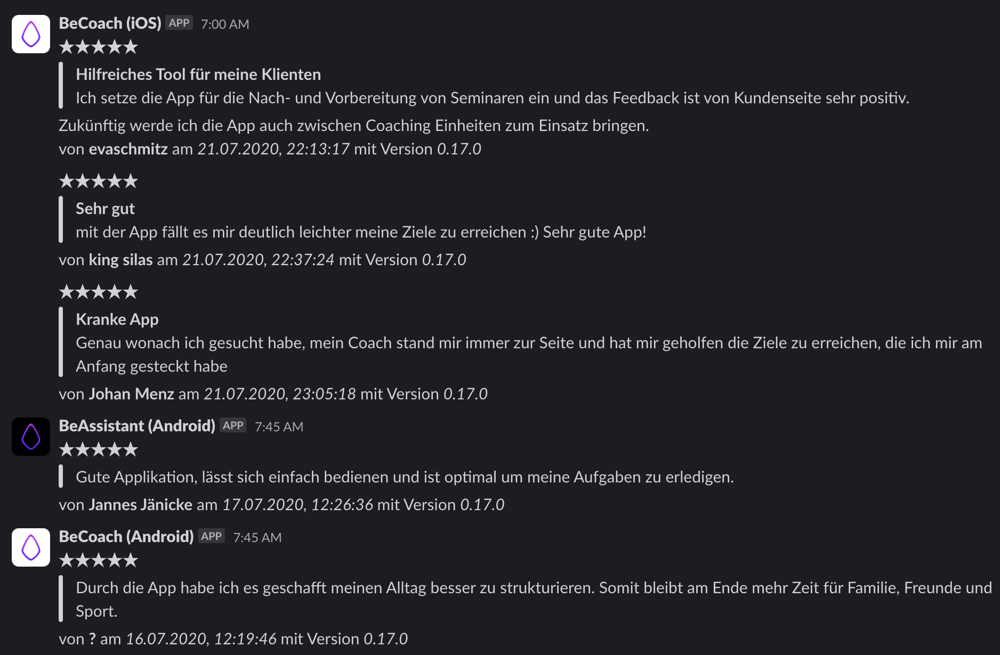

# appstatistics

Some Kotlin Code to gather some appstatistics from the App Store & Play Store. Currently, there's only support for Reviews but this will likely change.

## store-reviews

- Uses the Google API to get Android Reviews
- Uses the Apple API to get iOS reviews
- Reviews are stored locally
- Reviews be posted to Slack

### Get started

Check out the project and run `./gradlew store-reviews:run`. This will give you step by step instructions.

Alternatively, you can also build a fat Jar using `./gradlew store-reviews:shadowJar` and run it via `java -jar store-reviews/build/libs/store-reviews-all.jar`.

# License

Copyright (C) 2020 BeLabs UG

Licensed under the Apache License, Version 2.0
