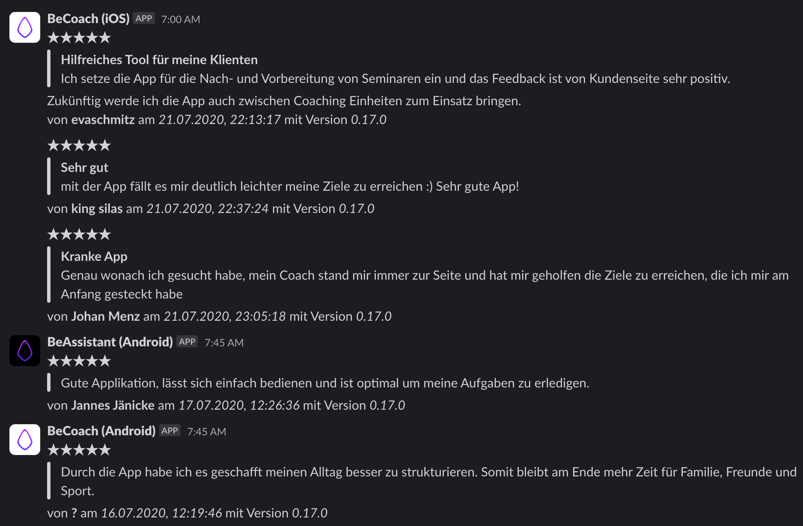
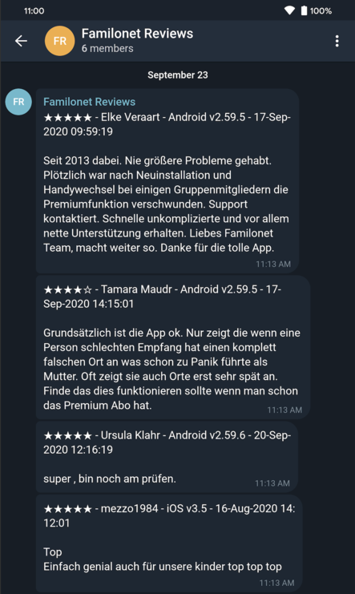

# appstatistics

Some Kotlin Code to gather some appstatistics from the App Store & Play Store.

There's support for:

- [store-reviews](#store-reviews)
- [inapp-products](#inapp-products)

## store-reviews

- Uses the Google API to get Android Reviews
- Uses the Apple API to get iOS reviews
- Reviews are stored locally
- Reviews can be sent to different services (Slack & Telegram)

### Get started

Check out the project and run `./gradlew store-reviews:run`. This will give you step by step instructions.

Alternatively, you can also build a fat Jar using `./gradlew store-reviews:shadowJar` and run it via `java -jar store-reviews/build/libs/store-reviews-all.jar`.

#### Slack example



#### Telegram Bot Example



### Crontab

It's best to build the project once using `./gradlew build` and then use crontab to fetch the reviews every now and then:

```cron
0 15 * * * java -jar $HOME/dev/GitHub/appstatistics/store-reviews/build/libs/store-reviews-all.jar
```

## inapp-products

- Uses the Google API to get inapp products
- Inapp products are retrieved & stored locally
- Add new inapp products

More support is coming.

### Get started

Check out the project and run `./gradlew inapp-products:run`. This will give you step by step instructions.

Alternatively, you can also build a fat Jar using `./gradlew inapp-products:shadowJar` and run it via `java -jar inapp-products/build/libs/inapp-products-all.jar`.

# License

Copyright (C) 2020 BeLabs UG

Licensed under the Apache License, Version 2.0
